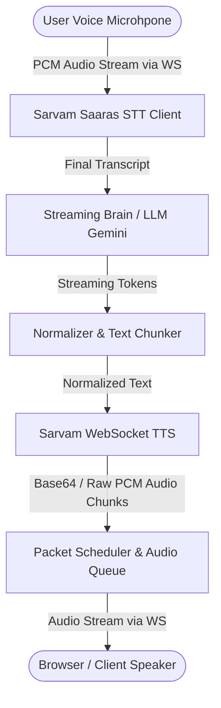

# Voice AI Application - Overview & Feature Guide

## 1. How the Application Works

The **Indic Voice AI Agent** is a full-duplex, low-latency conversational AI system designed for real-time multilingual voice calls in Indian regional languages and English.



### End-to-End Workflow:

1. **Call Connection**: When a call starts on the web UI (`/call`), a bidirectional WebSocket connection is established with the FastAPI backend (`/ws/v1/voice-call`).
2. **Parallel Handshake**: STT and TTS services connect to Sarvam AI in parallel to minimize startup latency.
3. **Instant Greeting**: The system greets the caller in the selected language (Hindi, Tamil, Telugu, Kannada, or English).
4. **Speech-to-Text (STT)**: User audio is streamed in real-time. Sarvam Saaras STT detects speech start/end events and returns transcribed text.
5. **Brain Processing (LLM)**: Transcripts are passed to Gemini LLM with strict single-language locking per turn.
6. **Text Normalization**: Special characters, numbers, and symbols are normalized for natural speech synthesis.
7. **Text-to-Speech (TTS)**: Full normalized text is sent to Sarvam WebSocket TTS to stream high-quality audio back to the client.
8. **Barge-in / Interruption Handling**: If the user starts speaking while the assistant is talking, the current TTS stream is cancelled instantly.

---

## 2. Key Features

- 🌐 **Multilingual Support**: Real-time voice conversations supported in:
  - **Hindi (`hi-IN`)**
  - **Tamil (`ta-IN`)**
  - **Telugu (`te-IN`)**
  - **Kannada (`kn-IN`)**
  - **English (`en-IN`)**
- ⚡ **Ultra-Low Latency Architecture**:
  - Parallel STT/TTS service initialization during call setup.
  - LLM connection pre-warming.
  - VAD (Voice Activity Detection) fallback optimized to 0.6 seconds.
  - Full-token response batching sent to TTS to prevent re-synthesis audio looping bugs.
- 🛑 **Full-Duplex Interruption (Barge-in)**: Allows users to cut off the AI response anytime by speaking.
- 🔒 **Turn-Level Language Locking**: Enforces strict language output per turn so the LLM doesn't randomly switch languages mid-sentence.
- 🔁 **Loop Protection & Deduplication**:
  - Audio chunk repeat-pattern detection and safety cap net.
  - Transcript deduplication window (2.5s) to eliminate duplicate voice triggers.
  - Stale utterance tracking with strict generation IDs.
- 📊 **Real-Time Latency Metrics**: Real-time tracking displayed on UI for:
  - STT Latency (ms)
  - Brain TTFT (Time to First Token in ms)
  - TTS First Audio Latency (ms)
- 🎨 **Web Phone UI**: Interactive phone interface hosted at `/call` or `/` featuring live caller state, audio waveform visualizer, and language selector.

---

## 3. What Has Been Done Till Now

1. **Phase 1: Core Voice Synthesis & Router Pipeline**

   - Built FastAPI orchestrator engine with REST (`/api/v1/stream-voice`) and WebSocket (`/ws/v1/stream-voice`) endpoints.
   - Integrated Sarvam AI WebSocket client for streaming TTS.
   - Built packet scheduler for regulated 20ms audio frame delivery.
   - Implemented caching layer for common phrases and instant greetings.
2. **Phase 2: Bidirectional Voice Call (`/ws/v1/voice-call`)**

   - Integrated Sarvam Saaras WebSocket STT for continuous real-time audio transcription.
   - Integrated Streaming Brain using Gemini LLM for conversational responses.
   - Connected STT → Brain → TTS full voice loop.
3. **Phase 3: Latency Hardening & Stability Optimization**

   - **Parallel Connections**: Optimized call startup by connecting STT and TTS in parallel via `asyncio.gather`.
   - **Reduced VAD Fallback**: Lowered silence fallback timeout from 1.5s down to 0.6s.
   - **Pre-warming**: Fire-and-forget pre-warming for Gemini LLM connection pool.
   - **Loop Bug Fix**: Fixed Sarvam TTS buffer re-synthesis loop by batching complete tokens before sending single chunk to TTS.
   - **Utterance Isolation**: Added `current_utterance_id` guard to drop stale audio when interrupted.
   - **UI Improvements**: Created mobile phone web interface in `static/index.html` with metrics display and multi-language dropdown (Hindi, Tamil, Telugu, Kannada, English).

---

## 4. How to Run the Application

```bash
# 1. Install dependencies
pip install -r requirements.txt

# 2. Set environment variables (or configure in config.py / .env)
# SARVAM_API_KEY=your_sarvam_api_key
# GEMINI_API_KEY=your_gemini_api_key

# 3. Start the FastAPI server
python -m uvicorn indic_tts_runtime.main:app --host 0.0.0.0 --port 8000 --reload

# 4. Open in browser
# Navigate to: http://localhost:8000/
```


### Key Summary of Changes

1. **Audio Codec & Resampler Utility** ([telephony_audio.py](<vscode-file://vscode-app/c:/Users/SHUBHAM.NAIK/AppData/Local/Programs/Microsoft%20VS%20Code/8a7abeba6e/resources/app/out/vs/code/electron-browser/workbench/workbench.html>)):

   * [telephony_to_stt_pcm()](<vscode-file://vscode-app/c:/Users/SHUBHAM.NAIK/AppData/Local/Programs/Microsoft%20VS%20Code/8a7abeba6e/resources/app/out/vs/code/electron-browser/workbench/workbench.html>): Decodes base64 telephony payloads, converts 8kHz 8-bit μ**μ**-law (PCMU) to 8kHz 16-bit linear PCM via pre-computed G.711 tables, and resamples up to 16kHz 16-bit PCM for `SarvamSaarasSTTClient`.
   * 

   * `tts_pcm_to_telephony()`: Downsamples 24kHz/22.05kHz 16-bit PCM from Sarvam TTS to 8kHz PCM, converts to 8-bit μ**μ**-law, and returns base64-encoded strings for Exotel media frames.
   * 

   1. **Multi-Tenant Exotel Endpoint** ([main.py**:1480**](<vscode-file://vscode-app/c:/Users/SHUBHAM.NAIK/AppData/Local/Programs/Microsoft%20VS%20Code/8a7abeba6e/resources/app/out/vs/code/electron-browser/workbench/workbench.html>)):

      * Added [@app.websocket(&#34;/ws/v1/exotel-stream&#34;)](<vscode-file://vscode-app/c:/Users/SHUBHAM.NAIK/AppData/Local/Programs/Microsoft%20VS%20Code/8a7abeba6e/resources/app/out/vs/code/electron-browser/workbench/workbench.html>) accepting [tenant_id: str = Query(&#34;default&#34;)](<vscode-file://vscode-app/c:/Users/SHUBHAM.NAIK/AppData/Local/Programs/Microsoft%20VS%20Code/8a7abeba6e/resources/app/out/vs/code/electron-browser/workbench/workbench.html>).
      * Configured tenant-specific system prompts, business metadata, and voice configurations.
      * Handled Exotel JSON frames ([connected](<vscode-file://vscode-app/c:/Users/SHUBHAM.NAIK/AppData/Local/Programs/Microsoft%20VS%20Code/8a7abeba6e/resources/app/out/vs/code/electron-browser/workbench/workbench.html>), [start](<vscode-file://vscode-app/c:/Users/SHUBHAM.NAIK/AppData/Local/Programs/Microsoft%20VS%20Code/8a7abeba6e/resources/app/out/vs/code/electron-browser/workbench/workbench.html>), `media`, `stop`, `closed`).
      * 

      1. **Full-Duplex Interruption & Barge-In** :

      * Monitored user speech during agent output turns.
      * Incremented [current_utterance_id](<vscode-file://vscode-app/c:/Users/SHUBHAM.NAIK/AppData/Local/Programs/Microsoft%20VS%20Code/8a7abeba6e/resources/app/out/vs/code/electron-browser/workbench/workbench.html>) to cancel active TTS tasks and dispatched Exotel [clear](<vscode-file://vscode-app/c:/Users/SHUBHAM.NAIK/AppData/Local/Programs/Microsoft%20VS%20Code/8a7abeba6e/resources/app/out/vs/code/electron-browser/workbench/workbench.html>) frames ([{&#34;event&#34;: &#34;clear&#34;, &#34;stream_sid&#34;: ...}](<vscode-file://vscode-app/c:/Users/SHUBHAM.NAIK/AppData/Local/Programs/Microsoft%20VS%20Code/8a7abeba6e/resources/app/out/vs/code/electron-browser/workbench/workbench.html>)) to instantly purge buffered phone line audio.
   1. 

   1. **Automated Call Termination (`[END_CALL]`)** :

   * Detected `[END_CALL]` tags in generated LLM responses and stripped them prior to normalization.
   * Synthesized and streamed farewell audio, waited for audio playback duration, and cleanly closed the WebSocket session to disconnect the call.
   * 

   1. **Automated Unit & Integration Test Suite** ([test_exotel_stream.py](<vscode-file://vscode-app/c:/Users/SHUBHAM.NAIK/AppData/Local/Programs/Microsoft%20VS%20Code/8a7abeba6e/resources/app/out/vs/code/electron-browser/workbench/workbench.html>)):
      * Validated telephony audio conversions, frame formatting, tenant system prompt injection, and WebSocket event handling.
